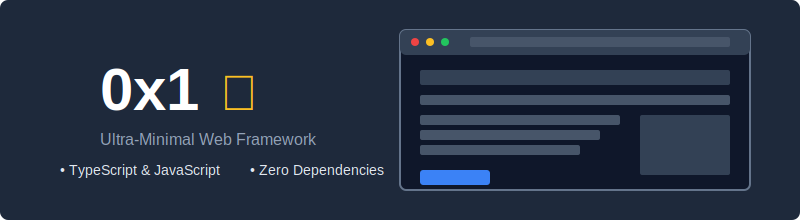

<p align="center">
  
</p>

<p align="center">
  <strong>Lightning-fast TypeScript-only web framework with zero overhead</strong><br>
  <span>The ultra-minimal, maximum performance framework powered by Bun</span>
</p>

<p align="center">
  <a href="#-quickstart"><strong>Quickstart</strong></a> ·
  <a href="#-features"><strong>Features</strong></a> ·
  <a href="#-cli-commands"><strong>CLI</strong></a> ·
  <a href="#-component-system"><strong>Components</strong></a> ·
  <a href="#-app-directory-structure"><strong>App Structure</strong></a> ·
  <a href="#-philosophy"><strong>Philosophy</strong></a>
</p>

<p align="center">
  <a href="https://www.npmjs.com/package/0x1"></a>
  <a href="https://www.npmjs.com/package/0x1"></a>
  <a href="https://github.com/Triex/0x1"></a>
  
  
</p>

<p align="center">
  <a href="https://bun.sh"></a>
  <a href="https://www.typescriptlang.org/"></a>
  
  
</p>

---

## ⚡ Features

### 💨 Extreme Performance
- **Tiny runtime**: <20kb total JS bundle size
- **Zero hydration cost**: No client-side hydration overhead
- **Native ESM**: Browser-native module loading without bundling
- **Precomputed content**: Minimal JS for maximum speed

### 🧩 Components Without Overhead
- **TypeScript-Only**: Exclusively built for TypeScript with full type safety
- **Simple API**: Modern component system, Next15-style/compatible, but without the bloat
- **Minimal abstractions**: Near-vanilla performance with type-checked templates
- **Custom Diffing**: Optimized DOM updates with TypeScript safety
- **Compile-time validation**: Catch errors early with strict typing

### 🧩 Component System

0x1 offers a simple but powerful component system built with TypeScript:

- Pure TypeScript components with full type safety
- JSX syntax without React dependencies
- Fast, lightweight rendering with minimal overhead
- Automatic TypeScript transpilation
- Support for component props and children

### 📁 App Directory Structure

**All 0x1 templates now exclusively use the Next.js 15-compatible app directory structure:**
- Modern app directory structure with file-based routing
- Nested layouts with component co-location
- Special file conventions for pages and layouts
- Native support for `page.tsx`, `layout.tsx`, `loading.tsx`, `not-found.tsx`, etc.
- Zero configuration required - works out of the box

### 📱 Progressive Web App Support
- **Auto-generated PWA assets**: Icons, splash screens, and manifest
- **Offline support**: Service worker with intelligent caching
- **Install prompts**: Native app-like experience
- **Dark/light modes**: Theme support for your PWA
- **Push notifications**: Ready infrastructure

### 🔁 Modern Routing & Data Flow
- **Zero-dependency router**: No external routing libraries needed
- **App directory routing**: Next.js 15-style file-based routing system
- **Server-first architecture**: Emphasis on server components and actions
- **Suspense-like API**: Async data loading with TypeScript safety
- **Code-splitting**: Automatic lazy loading for optimal performance
- **SPA navigation**: Fast page transitions without full reloads
- **Nested layouts**: Support for shared UI across routes
- **Special files**: Support for `page.tsx`, `layout.tsx`, `loading.tsx`, and `error.tsx`
- **Type-safe data fetching**: Server components with built-in fetch utilities
- **Next.js-compatible Link component**: Drop-in replacement for Next.js `Link`
- **Error boundaries**: Built-in error handling with detailed fallback UI

### 🔨️ Developer Experience
- **Bun-first architecture**: Fully optimized for Bun's capabilities with zero compromises
- **Lightning-fast hot reload**: Sub-second refresh times using Bun's native watch capabilities
- **Bun-powered build system**: Takes full advantage of Bun's bundling and transpilation speed
- **Native file operations**: Uses Bun's optimized file APIs for maximum performance
- **Tailwind integration**: Zero-config styling with built-in support and automatic optimization
- **TypeScript-exclusive**: Designed from the ground up for TypeScript with full type safety
- **Smart defaults**: Sensible configurations out of the box with minimal boilerplate
- **Theme flexibility**: Built-in support for light, dark and system theme modes


## 🚀 Quickstart

### Installation

```bash
# Install globally (recommended)
bun install -g 0x1

# Or use npx for one-off commands
npx 0x1@latest new my-app
```

### Create a New Project

```bash
# Create a new project with default options
0x1 new my-app

# Select template complexity
0x1 new my-app --complexity=minimal|standard|full

# With additional options
0x1 new my-app --javascript --theme="royal-purple" --pwa
```

### Development

```bash
# Navigate to your project
cd my-app

# Start the development server
0x1 dev

# Start with a specific port
0x1 dev --port=8080
```

Open [http://localhost:3000](http://localhost:3000) to view your app in action!

> **Port Management:** If the specified port (default: 3000) is already in use, the dev server will automatically try the next available port and notify you. This ensures seamless development without manual port configuration.

### Build and Deploy

```bash
# Create a production build
0x1 build

# Preview your production build locally
0x1 preview

# Deploy to production (various providers)
0x1 deploy
```

### 🚀 Deployment Options

0x1 projects are optimized for modern hosting platforms:

```bash
# Deploy to Vercel (recommended)
0x1 deploy --provider=vercel

# Deploy to Netlify
0x1 deploy --provider=netlify

# Custom deployment
0x1 build
# Then deploy the 'dist' directory
```

The framework is specially optimized for Vercel Edge Runtime and Netlify Edge Functions, providing the best possible performance at the edge.

## 💡 Community & Support

- [GitHub Issues](https://github.com/Triex/0x1/issues) - Bug reports and feature requests
- [GitHub Discussions](https://github.com/Triex/0x1/discussions) - Ask questions and share ideas
- [NPM Package](https://www.npmjs.com/package/0x1) - Latest releases

## 👷 Contributing

Contributions are welcome! Here's how you can help:

```bash
# Clone the repository
git clone https://github.com/Triex/0x1.git
cd 0x1

# Install dependencies
bun install

# Run tests
bun test

# Build the framework
bun run build
```

Please see our [Contributing Guidelines](https://github.com/Triex/0x1/blob/main/CONTRIBUTING.md) for more details.

## 📜 License

0x1 is licensed under the [TDL v1 License](https://github.com/Triex/0x1/blob/main/LICENSE).

---
---
---

# Expanded Documentation

_(to organise / work into website docs & full README appropriately)_

## 💡 Philosophy

0x1's philosophy is radically different from most modern frameworks:

1. **Zero abstraction cost**: No virtual DOM or complex state tracking
2. **Browser-native**: Leverage what browsers are good at
3. **Minimal over comprehensive**: Focused feature set, exceptional at few things
4. **No dependencies**: Entire framework in one tiny package
5. **Extreme performance**: Optimize for loaded page performance, not DX shortcuts


## 📋 Template Options

0x1 now offers a streamlined template selection process with three complexity levels, all built with TypeScript for maximum type safety and developer experience:

### Template Complexity Options

0x1 offers three levels of complexity for your projects, all built with TypeScript for maximum performance and safety:

#### 🔍 Minimal Template

**Ideal for:** Small projects, landing pages, or developers who want full control

- Basic structure with essential files only
- Perfect for landing pages or simple sites
- Tailwind CSS included
- Extremely lightweight with minimal dependencies

#### 🧩 Standard Template

**Ideal for:** Most web applications and sites

- Complete project structure with organized files
- Router implementation with multi-page support
- Component architecture for building complex UIs
- Tailwind CSS with dark mode support
- Common utility functions and helpers

#### 🚀 Full Template

**Ideal for:** Production applications with advanced features

- Everything in Standard, plus:
- Built-in state management system
- Progressive Web App (PWA) support
- Service worker for offline capabilities
- Advanced components with animations
- Background sync for offline form submissions
- Push notification infrastructure

Create your project using either of these commands:

```bash
# Using create command
bun create 0x1 my-app

# Or with CLI (if installed globally)
bun 0x1 new my-app

# Specify template complexity
bun 0x1 new my-app --complexity=minimal|standard|full
```

## 🚀 Getting Started

### Prerequisites

- [Bun](https://bun.sh) v1.0.0 or higher (REQUIRED)

### Create a New Project

```bash
# Using Bun directly
bun create 0x1 my-app

# Or install globally (recommended)
bun install -g 0x1

# Then create new projects with the CLI
0x1 new my-app

# With template complexity option
0x1 new my-app --complexity=minimal|standard|full

# With other options
0x1 new my-app --javascript --theme="royal-purple" --pwa
```

### Development

```bash
cd my-app
0x1 dev

# Start with a specific port
0x1 dev --port=8080
```

Open [http://localhost:3000](http://localhost:3000) to view your app in action!

> **Port Management:** If the specified port (default: 3000) is already in use, the dev server will automatically try the next available port and notify you. This ensures seamless development without manual port configuration.

### Project Structure

A standard 0x1 project includes these key files and folders:

```
my-app/
├── app/                    # App directory structure (Next.js 15-compatible)
│   ├── page.tsx            # Home page component
│   └── layout.tsx          # Root layout
├── components/             # Reusable components
├── styles/                 # CSS styles
├── public/                 # Static assets
├── 0x1.config.ts           # 0x1 configuration
├── package.json            # Project dependencies
├── tailwind.config.js      # Tailwind configuration (optional)
└── tsconfig.json           # TypeScript configuration
```

### Production Build

```bash
0x1 build
```

### Deploy

```bash
# Deploy to Vercel (recommended)
0x1 deploy --provider=vercel

# Deploy to Netlify
0x1 deploy --provider=netlify

# Custom deployment
0x1 build
# Then deploy the 'dist' directory
```

The framework is specially optimized for modern edge runtimes, providing the best possible performance.

## 📦 Version Information

Current version: **0.0.159**

This release provides all core functionality with a stable API, including:
- Fixed router regex pattern for robust routing
- Enhanced module loading with improved resolution for Next.js compatibility
- Automatic JSX runtime imports for layout components
- Optimized Tailwind CSS detection for app directory structure
- Clean export structure to prevent duplicates

### CLI Access Notes

When you install 0x1 globally with `bun install -g`, the installer automatically adds it to your PATH, allowing you to use the `0x1` command directly:

```bash
# Install globally
bun install -g 0x1

# Then use directly
0x1 new my-project
```

#### Troubleshooting

If you encounter issues with the `0x1` command not being found, you have these options:

1. **Use with bun directly:**
   ```bash
   bun 0x1 new my-project
   ```

2. **Use with bunx:**
   ```bash
   bunx 0x1 new my-project
   ```

3. **Manually update your PATH** (rarely needed):
   ```bash
   # Add these lines to your shell config (~/.bashrc, ~/.zshrc, etc.)
   export BUN_INSTALL="$HOME/.bun"
   export PATH="$BUN_INSTALL/bin:$PATH"
   ```

The automatic PATH configuration should work for most users, and you'll only need these alternatives in special circumstances.

## ⚛️ Custom JSX Runtime

0x1 includes its own custom JSX runtime that completely eliminates React dependencies while maintaining full JSX functionality:

### Key Features

- **Zero React dependencies**: Use JSX without installing React or any other framework
- **Automatic JSX transforms**: JSX syntax is automatically converted to efficient function calls
- **Development mode support**: Includes both production and development JSX runtimes with enhanced debugging
- **Next.js 15 compatibility**: Works seamlessly with modern app directory structure
- **TypeScript integration**: Full type safety for JSX components and their props

### Usage Example

```tsx
// No imports needed - JSX just works!
export function MyComponent({ title, children }) {
  return (
    <div className="container">
      <h1>{title}</h1>
      <div className="content">{children}</div>
    </div>
  );
}
```

### How It Works

1. **Automatic Transpilation**: The 0x1 build system detects JSX files and transforms them using Bun's bundler
2. **Runtime Functions**: JSX elements are converted to calls to `createElement` and `Fragment` from 0x1's runtime
3. **Zero Configuration**: No need to configure JSX settings - the framework handles everything
4. **Development Support**: Automatically switches between optimized production and enhanced dev runtimes

The 0x1 JSX transpiler handles all imports and transformations automatically, generating extremely optimized code with zero runtime overhead. This allows you to use modern JSX syntax without the bloat of traditional frameworks.

## 🏎️ Performance Comparison

Expected out-of-the-box performance

| Metric              | 0x1 | React | Vue  | Svelte | Next.js |
|---------------------|-------|-------|------|--------|---------|
| JS Size (gzip)      | 5kB   | 44kB  | 31kB | 4-21kB | 80kB+   |
| Time to Interactive | 0.3s  | 1.1s  | 0.7s | 0.6s   | 1.5s+   |
| Memory Usage        | Low   | High  | Med  | Low    | High    |
| Lighthouse Score    | 100   | 75-85 | 85-95| 90-95  | 70-85   |

## 🔗 Next.js-Compatible Link Component

0x1 provides a fully Next.js-compatible `Link` component for client-side navigation, making migration from Next.js seamless. You can use the component in two ways:

### Import Options

1. **Simple import from the main package (recommended for new projects):**

```tsx
import { Link } from '0x1';

function Navigation() {
  return (
    <nav>
      <Link href="/">Home</Link>
      <Link href="/about">About</Link>
      <Link href="/contact">Contact</Link>
    </nav>
  );
}
```

2. **Direct replacement for Next.js imports (perfect for migration):**

```tsx
import Link from '0x1/link';

// Just change 'next/link' to '0x1/link' and everything works!
function Navigation() {
  return (
    <nav>
      <Link href="/">Home</Link>
      <Link href="/contact">Contact</Link>
    </nav>
  );
}
```

### Supported Features

The Link component supports all core Next.js Link features:

```tsx
// Basic usage
<Link href="/about">About</Link>

// With query parameters
<Link
  href={{
    pathname: '/products',
    query: { category: 'electronics' }
  }}
>
  Electronics
</Link>

// Replace instead of push to history
<Link href="/dashboard" replace>Dashboard</Link>

// Disable scrolling to top
<Link href="/contact" scroll={false}>Contact</Link>

// Disable prefetching (placeholder for API compatibility)
<Link href="/gallery" prefetch={false}>Gallery</Link>
```

### Migration from Next.js

To migrate from Next.js to 0x1, simply find and replace all import statements:

```bash
# Find all Next.js Link imports
find ./src -type f -name "*.tsx" -exec grep -l "next/link" {} \;

# Replace in all files
sed -i 's/next\/link/0x1\/link/g' **/*.tsx
```

## 🧩 Component System

0x1's component system is intentionally simple but powerful:

```tsx
// No need to import React! 0x1 has its own JSX runtime

// Define a component
interface ButtonProps {
  onClick: () => void;
  label: string;
}

export function Button({ onClick, label }: ButtonProps) {
  return (
    <button
      className="btn"
      onClick={onClick}
    >
      {label}
    </button>
  );
}

// Use the component
function App() {
  return (
    <div>
      <Button
        onClick={() => console.log('Clicked!')}
        label="Click me"
      />
    </div>
  );
}
```

## 🗺️ Routing

0x1 uses a simple but powerful routing system:

```typescript
import { Router } from '0x1';

// Initialize the router with the root element
const router = new Router(document.getElementById('app')!);

// Add routes
router.addRoute('/', HomePage);
router.addRoute('/about', AboutPage);
router.addRoute('/products/:id', ProductPage);

// Set a handler for 404 pages
router.setNotFound(NotFoundPage);

// Start the router
router.navigateTo('/');
```

## 🎭 Suspense-like Data Loading

```tsx
import { useState, useEffect } from '0x1';

interface Product {
  id: string;
  name: string;
  description: string;
  price: string;
}

interface ProductPageProps {
  params: { id: string };
}

export function ProductPage({ params }: ProductPageProps) {
  const [product, setProduct] = useState<Product | null>(null);
  const [loading, setLoading] = useState(true);

  useEffect(() => {
    async function loadProduct() {
      setLoading(true);
      const data = await fetchProduct(params.id);
      setProduct(data);
      setLoading(false);
    }

    loadProduct();
  }, [params.id]);

  return (
    <div className="product-container">
      {loading ? (
        <div className="loading">Loading product...</div>
      ) : product ? (
        <>
          <h1>{product.name}</h1>
          <p>{product.description}</p>
          <span className="price">{product.price}</span>
        </>
      ) : (
        <div className="error">Product not found</div>
      )}
    </div>
  );
}
```

## 🖌️ Styling

0x1 works seamlessly with Tailwind CSS and includes PostCSS setup:

```tsx
// styles are automatically processed
import './styles.css';

interface CardProps {
  children?: string | JSX.Element | (string | JSX.Element)[];
}

export function Card({ children = 'Card content here' }: CardProps) {
  return (
    <div className="p-4 bg-white rounded shadow-lg hover:shadow-xl transition-shadow">
      {children}
    </div>
  );
}
```

## 📄 CLI Commands

| Command | Description |
|---------|-------------|
| `0x1 new <name>` | Create a new 0x1 project |
| `0x1 dev` | Start development server |
| `0x1 build` | Create production build |
| `0x1 preview` | Preview production build |
| `0x1 deploy` | Deploy to production |
| `0x1 pwa` | Add Progressive Web App functionality |
| `0x1 generate component <name>` | Generate a component |
| `0x1 generate page <name>` | Generate a page |

## 🗂️ Project Structure

```
my-app/
├── 0x1.config.ts           # 0x1 configuration
├── src/
│   ├── components/           # Reusable components
│   ├── pages/                # Page components
│   ├── framework/            # Extended framework code (optional)
│   ├── styles/               # CSS styles
│   ├── utils/                # Utility functions
│   ├── app.ts                # Application entry
│   └── index.html            # HTML entry point
├── public/                   # Static assets
├── package.json              # Project dependencies
├── postcss.config.js         # PostCSS configuration
├── tailwind.config.js        # Tailwind configuration
└── tsconfig.json             # TypeScript configuration
```

## 🎨 Tailwind CSS Integration

0x1 now provides **automatic Tailwind CSS processing** during development and build:

### Zero-Config Auto-Detection

When you run `0x1 dev`, the framework automatically:

1. Detects if you have a `tailwind.config.js` file in your project
2. Finds your CSS input file (typically in `styles/main.css` or similar locations)
3. Creates the processed output file at `public/styles/tailwind.css`
4. Watches for changes during development
```bash
# No extra setup required!
# Just install Tailwind CSS
bun add -d tailwindcss postcss autoprefixer

# Create a tailwind.config.js
bunx tailwindcss init

# Create an input CSS file
mkdir -p styles
echo '@tailwind base;\n@tailwind components;\n@tailwind utilities;' > styles/main.css
```

Then just run 0x1 dev:

```bash
0x1 dev
```

That's it! 0x1 automatically detects and processes your Tailwind CSS files, handling everything for you.

### Next.js-Like Developer Experience

The 0x1 framework is designed to provide a seamless, Next.js-like developer experience:

```json
// package.json - Simple and elegant
{
  "scripts": {
    "dev": "0x1 dev",     // Starts development server with hot reload
    "build": "0x1 build", // Optimized production build
    "preview": "0x1 preview" // Preview production build
  }
}
```

Features include:

1. **Zero-Config TypeScript** - TypeScript files are automatically bundled with the correct settings
2. **Automatic CSS Processing** - Tailwind and PostCSS are handled automatically
3. **Fast Refresh** - Changes are immediately reflected without losing state
4. **Smart Routing** - Route handling without complex configuration
5. **Flexible Structure** - Support for both root-level and src directory project structures

To disable automatic Tailwind processing:

```bash
0x1 dev --skip-tailwind
```

### Configuration Options

You can configure file ignoring in your 0x1.config.js:

```javascript
// 0x1.config.js
export default {
  build: {
    // Patterns to ignore when building or watching
    ignore: [
      'node_modules',
      '.git',
      'dist',
      '.DS_Store',
      '*.log',
      'coverage',
      '.vscode',
      '.github',
      'tmp',
      'docs'
    ]
  }
}
```

## 📕 Configuration

0x1 configuration is minimal and straightforward:

```typescript
// 0x1.config.ts
import { _0x1Config } from '0x1';

const config: _0x1Config = {
  app: {
    name: 'my-0x1-app',
    title: 'My 0x1 App',
    description: 'Built with 0x1 framework'
  },
  server: {
    port: 3000,
    host: 'localhost',
    basePath: '/'
  },
  routes: {
    '/': './pages/home',
    '/about': './pages/about',
    '/products/:id': './pages/product'
  },
  styling: {
    tailwind: true,
    darkMode: 'class',
    customTheme: {
      colors: {
        primary: '#0077cc'
      }
    }
  },
  optimization: {
    minify: true,
    precomputeTemplates: true,
    prefetchLinks: true
  },
  deployment: {
    provider: 'vercel', // or 'netlify', 'cloudflare', etc.
    edge: true
  }
};
```

## 🛠️ Advanced Usage

### Custom server middleware

```typescript
// 0x1.config.ts
export default {
  // ...other config
  server: {
    middleware: [
      async (req, res, next) => {
        console.log(`Request: ${req.url}`);
        await next();
      }
    ]
  }
};
```

### Custom build processes

```typescript
// 0x1.config.ts
export default {
  // ...other config
  build: {
    hooks: {
      beforeBuild: async () => {
        console.log('Starting build process...');
      },
      afterBuild: async () => {
        console.log('Build complete!');
      }
    }
  }
};
```

## 📈 0x1 vs Other Frameworks

### Why 0x1?

- **Radically minimal**: Focus on what matters
- **Performance first**: No compromises for DX
- **Zero dependencies**: No supply chain vulnerabilities
- **Exceptionally small**: Tiny bundle size
- **Browser-native**: Uses what browsers are good at

## 📦 Contributing

See [CONTRIBUTING.md](CONTRIBUTING.md) for details on how to contribute to 0x1.

## 🚀 App Directory Structure (Next.js 15-Style)

0x1 now supports a modern Next.js 15-style app directory structure with file-based routing, nested layouts, and special file conventions.

### File Conventions

```
app/
  layout.tsx      # Root layout (required)
  page.tsx        # Home page component for the root route
  not-found.tsx   # Custom 404 page
  about/
    page.tsx      # /about route
  contact/
    page.tsx      # /contact route
  features/
    layout.tsx    # Nested layout for the features section
    page.tsx      # /features route
    [id]/         # Dynamic route segment
      page.tsx    # /features/[id] route
```

### Special Files

- `page.tsx` - Renders the unique UI of a route and makes it publicly accessible
- `layout.tsx` - Shared UI for a segment and its children
- `loading.tsx` - Loading UI for a segment and its children
- `error.tsx` - Error UI for a segment and its children
- `not-found.tsx` - UI for 404 errors

### How Routing Works

- **Automatic Route Discovery**: The `Router` automatically discovers all pages in the `app` directory
- **Nested Layouts**: Layouts wrap child routes and persist across route changes
- **Client Navigation**: Full client-side navigation without page refreshes
- **Zero Configuration**: No need to manually register routes

## 📱 PWA Features <a name="pwa-features"></a>

### Creating a PWA

Turn your web application into a Progressive Web App with a single command:

```bash
0x1 pwa
```

This interactive command will guide you through configuring your PWA, including:

- App name and metadata
- Theme colors and visual styles
- Icon generation (standard, maskable, and splash screens)
- Offline support with customizable strategies
- Service worker setup with advanced caching options

### PWA Configuration Options

#### Adding PWA during project creation

The easiest way to add PWA functionality is during project creation:

```bash
# Create a new project with PWA support and custom theme
0x1 new my-project --pwa --theme "royal-purple"
```

During interactive project creation, you'll get these options:

1. **Project theme selection** - Choose from several beautiful themes that affect both the application and PWA appearance:
   - Midnight Blue - Dark blue theme with modern accents
   - Forest Green - Natural green theme with earthy tones
   - Royal Purple - Rich purple theme with elegant styling
   - Slate Gray - Neutral gray theme with professional look
   - Classic - Default 0x1 styling

2. **PWA options** - Enable Progressive Web App features with:
   - Automatic icon generation based on project name (extracts initials or meaningful characters)
   - Theme-based icon styling with visual elements matching your selected theme
   - Custom PWA colors if desired

#### Adding PWA to existing projects

For existing projects, use the `pwa` command with customization options:

```bash
# Basic usage with common options
0x1 pwa --name "My Amazing App" --themeColor "#ff0000" --offline

# Full customization
0x1 pwa --name "My App" \
         --shortName "App" \
         --themeColor "#0077cc" \
         --backgroundColor "#ffffff" \
         --description "My awesome PWA application" \
         --icons \
         --offline \
         --skipPrompts
```

#### Available Theme Colors

When creating a project through the interactive CLI, you can choose from these predefined theme colors:

- **Blue**: `#0077cc` (Default)
- **Slate**: `#475569`
- **Green**: `#059669`
- **Purple**: `#7c3aed`
- **Rose**: `#e11d48`
- **Custom**: Enter any valid hex color

#### iOS Status Bar Options

For iOS devices, you can customize the appearance of the status bar in your PWA:

- **Default**: Standard gray background with default text color
- **Black**: Black background with white text
- **Black Translucent**: Content appears under the status bar, creating a true fullscreen experience

The black-translucent option is particularly useful for immersive UIs where you want your app content to extend to the very top of the screen.

### Advanced PWA Features

- **Complete Asset Generation**: Automatically generates all required icons, including:
  - Standard icons (multiple sizes)
  - Maskable icons for Android adaptive icons
  - iOS splash screens
  - Favicons
  - Shortcut icons for quick actions

- **Intelligent Service Worker**: Provides:
  - Network-first strategy for dynamic content
  - Cache-first strategy for static assets
  - Offline fallback page with customizable styling
  - Automatic cache management
  - Background sync for form submissions

- **Enhanced User Experience**:
  - Install prompt with customizable timing
  - Native app-like experience on home screen
  - Offline indication and notifications
  - Update notifications when new content is available
  - Dark mode support for PWA components

- **Developer Experience**:
  - TypeScript-first implementation
  - Simple API for service worker registration
  - Customizable caching strategies
  - Easy offline page customization
  - Built-in connectivity detection

### TDL License Integration

0x1 now supports the TriexDev License (TDL) directly in its project creation flow:

```bash
0x1 new my-project --tdlLicense
```

This will automatically include the TDL v1 license in your project.

## 🔧 Troubleshooting

### Global CLI Installation Issues

If you encounter `command not found: 0x1` after installing globally with `bun install -g 0x1`, this is because Bun doesn't automatically add its bin directory to your PATH.

#### Quick Solution

You can always use Bun directly to run 0x1 commands without PATH configuration:

```bash
# Alternative way to run any 0x1 command
bunx 0x1 <command>
```

#### Permanent Fix

Add Bun's bin directory to your PATH:

**For macOS (zsh shell - default):**
```bash
# Add these lines to your ~/.zshrc file
export BUN_INSTALL="$HOME/.bun"
export PATH="$BUN_INSTALL/bin:$PATH"

# Then reload your shell configuration
source ~/.zshrc
```

**For Linux/older macOS (bash shell):**
```bash
# Add these lines to your ~/.bashrc or ~/.bash_profile file
export BUN_INSTALL="$HOME/.bun"
export PATH="$BUN_INSTALL/bin:$PATH"

# Then reload your shell configuration
source ~/.bashrc  # or source ~/.bash_profile
```

**For fish shell:**
```fish
# Add these lines to your ~/.config/fish/config.fish file
set -x BUN_INSTALL "$HOME/.bun"
set -x PATH "$BUN_INSTALL/bin" $PATH

# Then reload your shell configuration
source ~/.config/fish/config.fish
```

**For Windows (WSL):**
```bash
# Add these lines to your ~/.bashrc file in WSL
export BUN_INSTALL="$HOME/.bun"
export PATH="$BUN_INSTALL/bin:$PATH"

# Then reload your shell configuration
source ~/.bashrc
```

### Content Not Showing in Browser

If you're experiencing issues with content not displaying in your browser when running a 0x1 project:

1. **Check Browser Console**: Look for MIME type errors related to ES modules

2. **Script Tag Type**: Ensure your script tags in `index.html` don't have `type="module"` if you're not using a bundler:
   ```html
   <!-- Use this for direct browser loading -->
   <script src="./app.js"></script>

   <!-- Not this, unless bundling properly -->
   <!-- <script type="module" src="./app.js"></script> -->
   ```

3. **Build Process**: Run the build script before starting the dev server:
   ```bash
   bun run build.js && bun dev
   ```

4. **TypeScript Compilation**: The dev server automatically transpiles TypeScript files, but ensure you're not using ES module imports/exports without proper bundling:
   ```typescript
   // Instead of ES module imports:
   // import { something } from './somewhere';

   // Use pattern that works in browsers:
   const { something } = window.globalNamespace;
   ```

5. **Dev Server Configuration**: The 0x1 dev server has been updated to properly handle TypeScript files and set the correct MIME types for browser compatibility.

## 🗂️ Template Structure

All templates now follow the app directory structure with standardized organization patterns:

### Shared Structure Across All Templates

```
project-name/
├── app/              # app directory structure
│   ├── layout.tsx    # Root layout wrapper (required)
│   ├── page.tsx      # Home page component
│   ├── not-found.tsx # 404 error page
│   ├── about/        # Route folder
│   │   └── page.tsx  # About page component
│   ├── contact/      # Route folder
│   │   └── page.tsx  # Contact page component
│   └── features/     # Route folder
│       └── page.tsx  # Features page component
├── components/       # Shared components
│   ├── Button.tsx
│   ├── Card.tsx
│   └── ThemeToggle.tsx
├── lib/             # Library code and utilities
│   ├── component-registry.ts # Component registry for app directory
│   ├── jsx-runtime.tsx      # JSX runtime implementation
│   └── theme.ts            # Theme management
├── public/          # Static assets
│   ├── favicon.svg
│   └── manifest.json # PWA manifest (full template only)
├── store/           # State management (standard and full templates)
│   └── index.ts
├── styles/          # CSS styling with Tailwind
│   └── main.css
├── index.html       # HTML template
├── index.tsx        # Application entry point
├── 0x1.config.ts    # Framework configuration
├── tailwind.config.js # Tailwind configuration
└── package.json     # Dependencies and scripts
```

### Template Differences

#### Minimal Template
The minimal template includes only essential files with a simplified app directory structure, basic components, and core styling.

#### Standard Template
The standard template adds more components, state management, and enhanced routing capabilities while maintaining the app directory structure.

#### Full Template
The full template includes everything from standard plus Progressive Web App (PWA) support, advanced components, theming, animations, and comprehensive state management.

---

## Pending Features

Actual project intent is to allow development in Next/React styles-flows-APIs that everyone is used to, but allow devs to instantly spin up what usually takes hours of work, with the added benefit of Bun's speed and zero dependencies.

Ultimately; adding crypto features to give the framework a real use case, and ability to grow rapidly. (Hence 0x1)

- [ ] `Crypto` template option with various crypto features as options, inc;
  - [ ] `Wallet Connect`, basic connect for `ERC20` EVM tokens, and SOL, etc. OR allow all chains.
  - [ ] `Coin dApp / Dashboard`, view connected wallet coin holdings, transactions + coin price, market cap, etc as appropriate.
  - [ ] `NFT`, NFT viewing UI, basic NFT minting and collection features.
- [ ] Audit / ensure stable app router functionality (`"use server"`, `"use client"` tags work, `page.tsx` `actions.ts` work)
- [x] Full `ErrorBoundary` support, like `react-error-boundary` or `next-error-boundary`
